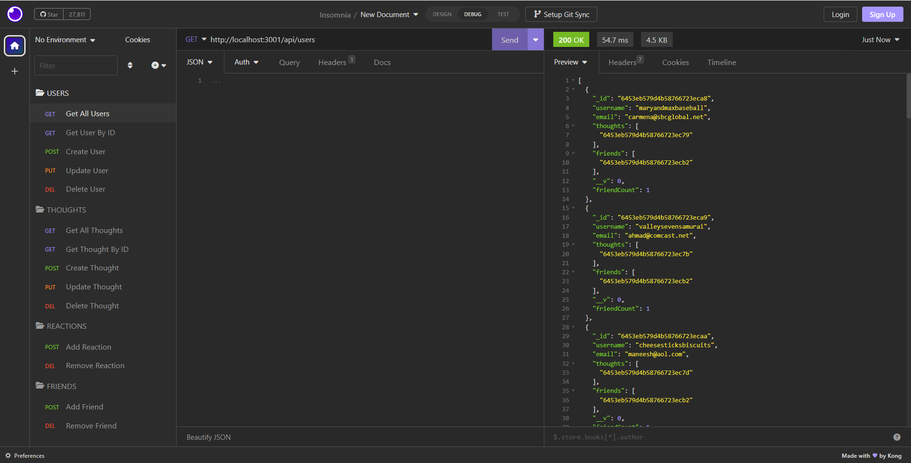
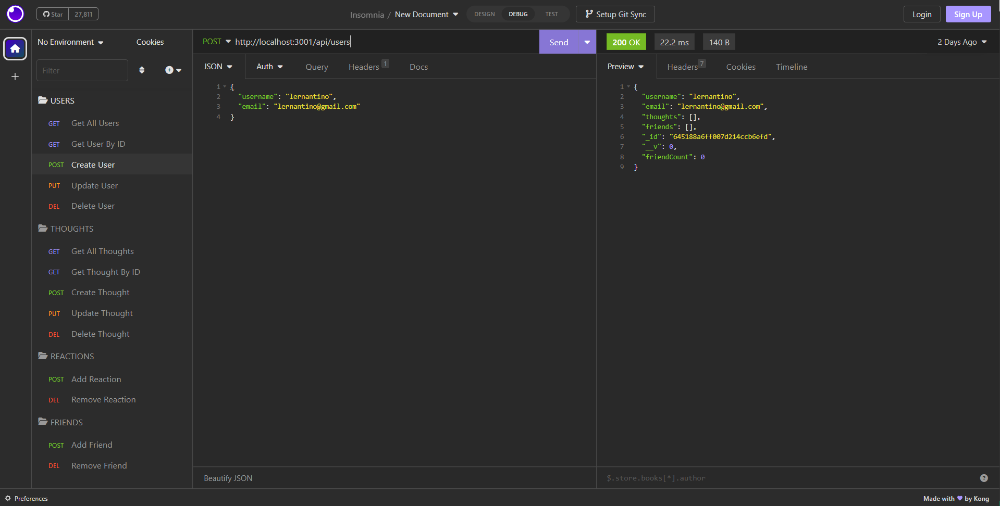
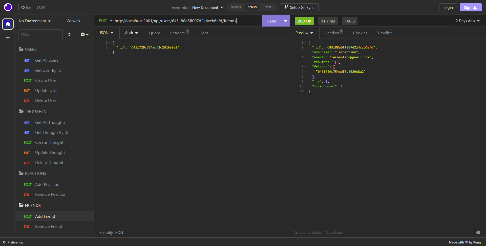

# social-network-api
A social network API created using a MongoDB database.

## User Story
AS A social media startup  
I WANT an API for my social network that uses a NoSQL database  
SO THAT my website can handle large amounts of unstructured data

## Link to Video Walkthrough
[Social Network API](*)

## Site Functionality
* Run 'npm seed' to seed a MongoDB database with demo data
* Use the command line to run 'npm start' to start a server and connect to the MongoDB database
* Test the following functional API routes, as listed in the ./routes/api folder:
  * Users: Get All, Get by ID, Create, Update, Delete
  * Thoughts: Get All, Get by ID, Create, Update, Delete
  * Reactions: Add, Remove
  * Friends: Add, Remove
* Users and Thoughts exist as their own independent models; reactions are a subdocument collection/schema under thoughts and friends are managed in the user schema
* When a user is deleted, their associated thoughts are also deleted
* Informative error messages display when using an incorrect route or object ID

## Screenshots

## License
This project is licensed under the MIT License - see the LICENSE.md file for details.

# NPM Packages Utilized
- [Mongoose](https://www.npmjs.com/package/mongoose)
- [DayJS](https://www.npmjs.com/package/dayjs)
- [Express](https://www.npmjs.com/package/express)
- [Nodemon](https://www.npmjs.com/package/nodemon)
